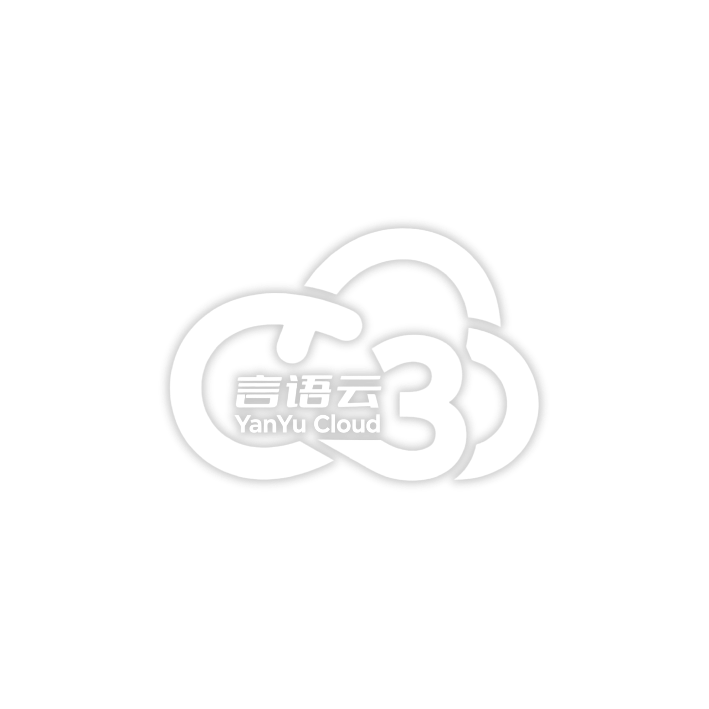

# YYC³ - 智能 SaaS 平台

**万象归元于云枢，深栈智启新纪元**

[功能特性](#功能特性) • [快速开始](#快速开始) • [文档](#文档) • [贡献](#贡献) • [许可证](#许可证)

---

## 项目简介

YYC³ 是一个现代化的企业级 SaaS 平台，专注于为企业提供 AI 驱动的智能化业务管理解决方案。通过整合智能数据分析、AI 协作助手、智能客服和工作流自动化，帮助企业实现数字化转型与业务增长。

## 功能特性

### 🤖 核心 AI 功能

#### 1. 智能数据分析助手
- 自然语言数据查询
- 实时数据可视化
- AI 驱动的数据洞察
- 智能图表生成

#### 2. AI 协作助手
- 会议纪要自动生成
- 智能任务分配
- 团队协作优化
- 文档自动摘要

#### 3. 智能客服
- 7×24 AI 客服机器人
- 知识库智能检索
- 工单自动创建
- 情感分析

#### 4. 工作流自动化
- 可视化工作流设计
- AI 流程优化分析
- 自动化规则生成
- 执行监控和分析

#### 5. 数据隐私与安全
- 数据脱敏处理
- 隐私设置管理
- 安全审计日志
- 成本控制

### ⚡ 技术亮点

- **现代化技术栈**: Next.js 16 + React 19.2 + TypeScript
- **AI 驱动**: 基于 Vercel AI SDK v5 构建
- **流式响应**: 所有 AI 功能支持实时流式输出
- **性能优化**: 三级缓存架构 + 代码分割
- **安全可靠**: 数据加密 + 审计日志 + 隐私保护

## 快速开始

### 前置要求

- Node.js 18.17 或更高版本
- pnpm 8.0 或更高版本（推荐）

### 安装

\`\`\`bash
# 克隆仓库
git clone https://github.com/your-org/yyc3-saas.git
cd yyc3-saas

# 安装依赖
pnpm install

# 复制环境变量
cp .env.example .env.local

# 配置环境变量（编辑 .env.local）
\`\`\`

### 开发

\`\`\`bash
# 启动开发服务器
pnpm dev

# 在浏览器中打开 http://localhost:3000
\`\`\`

### 构建

\`\`\`bash
# 构建生产版本
pnpm build

# 运行生产服务器
pnpm start
\`\`\`

## 项目结构

\`\`\`
yyc3-saas/
├── app/                    # Next.js App Router
│   ├── analytics/         # 智能数据分析
│   ├── collaboration/     # AI 协作助手
│   ├── support/           # 智能客服
│   ├── workflow/          # 工作流自动化
│   ├── admin/             # 管理后台
│   └── api/               # API 路由
├── components/            # React 组件
│   ├── ui/               # 基础 UI 组件
│   └── ...               # 功能组件
├── lib/                   # 工具库和业务逻辑
│   ├── ai/               # AI 相关工具
│   └── ...               # 其他工具
├── scripts/              # 数据库脚本
├── docs/                 # 文档
└── public/               # 静态资源
\`\`\`

## 文档

- [架构文档](./ARCHITECTURE.md) - 系统架构和技术栈详解
- [API 文档](./API.md) - API 接口文档
- [代码规范](./CODING_STANDARDS.md) - 代码风格和最佳实践
- [部署指南](./DEPLOYMENT.md) - 部署和运维指南
- [贡献指南](./CONTRIBUTING.md) - 如何参与贡献
- [环境配置](./ENV_SETUP.md) - 环境变量配置指南
- [产品路线图](./ROADMAP.md) - 产品发展规划
- [AI 功能规划](./AI_FEATURES.md) - AI 功能详细设计
- [安全政策](./SECURITY.md) - 安全和隐私政策

## 技术栈

### 前端
- **框架**: Next.js 16 (App Router)
- **UI 库**: React 19.2
- **类型**: TypeScript 5
- **样式**: Tailwind CSS 4
- **组件**: shadcn/ui
- **动画**: Framer Motion 12
- **图表**: Recharts 2

### 后端
- **AI**: Vercel AI SDK 5
- **验证**: Zod 3
- **日期**: date-fns 4

### 基础设施
- **部署**: Vercel
- **数据库**: PostgreSQL (Supabase/Neon)
- **缓存**: Redis (Upstash)
- **存储**: Vercel Blob
- **监控**: Vercel Analytics

## 环境变量

查看 [ENV_SETUP.md](./ENV_SETUP.md) 了解详细的环境变量配置指南。

关键环境变量：

\`\`\`bash
# 数据库
DATABASE_URL=postgresql://...

# AI 服务
OPENAI_API_KEY=sk-...

# 认证
NEXTAUTH_SECRET=...

# 第三方服务
STRIPE_SECRET_KEY=sk_...
\`\`\`

## 部署

### Vercel 部署（推荐）

\`\`\`bash
# 安装 Vercel CLI
npm i -g vercel

# 部署
vercel --prod
\`\`\`

### Docker 部署

\`\`\`bash
# 构建镜像
docker build -t yyc3-saas .

# 运行容器
docker run -p 3000:3000 yyc3-saas
\`\`\`

查看 [DEPLOYMENT.md](./DEPLOYMENT.md) 了解详细部署指南。

## 贡献

我们欢迎所有形式的贡献！请查看 [CONTRIBUTING.md](./CONTRIBUTING.md) 了解如何参与。

### 贡献者

感谢所有贡献者的付出！

## 路线图

查看 [ROADMAP.md](./ROADMAP.md) 了解产品发展规划。

### 近期计划

- [ ] 移动端应用
- [ ] 多语言支持
- [ ] 高级分析功能
- [ ] 第三方集成市场

## 许可证

本项目采用 MIT 许可证 - 详见 [LICENSE](LICENSE) 文件

## 联系我们

- **官网**: https://yyc3.app
- **邮箱**: support@yyc3.app
- **文档**: https://docs.yyc3.app
- **社区**: https://community.yyc3.app
- **GitHub**: https://github.com/your-org/yyc3-saas

## 致谢

感谢以下开源项目：

- [Next.js](https://nextjs.org/)
- [React](https://react.dev/)
- [Tailwind CSS](https://tailwindcss.com/)
- [shadcn/ui](https://ui.shadcn.com/)
- [Vercel AI SDK](https://sdk.vercel.ai/)

---

**YYC³** - 智能驱动业务增长 🚀

Made with ❤️ by YYC³ Team

